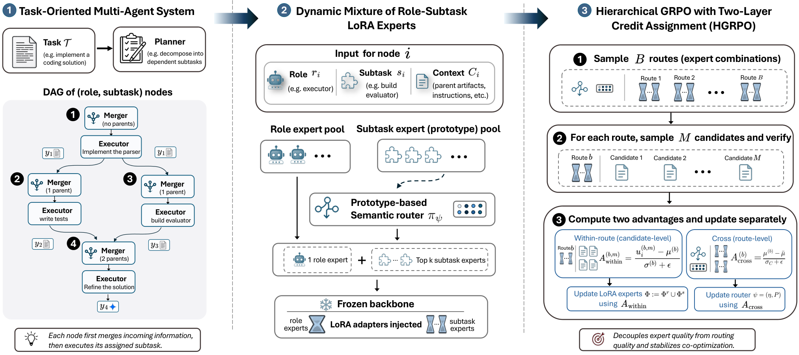

<div align="center">

# MoRSE: Task-Oriented Multi-Agent System with<br>Mixture of Role-Subtask Experts

**NeurIPS 2026**

Peiwen Li · Shiyang Zhang · Yangtian Zhang · Sizhuang He · David van Dijk · Rex Ying

**Yale University**

<p>
  <a href="https://arxiv.org/abs/2608.09251"></a>
  <a href="https://neurips.cc/Conferences/2026"></a>
</p>

</div>

<p align="center">
  
</p>

> [!NOTE]
> 🚧 Code is being prepared for release and will be available soon — stay tuned!

## 🔥 News

- **[2026-09]** 🎉 MoRSE is accepted to **NeurIPS 2026**!
- **[2026-08]** 📄 The paper is available on [arXiv](https://arxiv.org/abs/2608.09251).

## ✨ Overview

Existing LLM-based multi-agent systems mainly rely on coarse prompt-level differentiation without parameter adaptation for diverse subtasks, resulting in insufficient inter-agent heterogeneity and limited specialized capability. **MoRSE** distinguishes agents with **(role, subtask)-conditional specialization** at both the task-structure and parameter levels:

- 🧭 **Task-Oriented Multi-Agent System (ToMAS)** decomposes each task into a dependency-aware DAG of subtasks and assigns each agent a specific (role, subtask), introducing task-level specialization across collaborating agents.
- 🧩 **Mixture of Role-Subtask LoRA Experts (MoLE)** uses a dynamic mixture of (role, subtask) LoRA experts with a prototype-based semantic router, augmenting agents with parameter-level specialization on a shared LLM substrate cost-effectively.
- 🎯 **Hierarchical GRPO (HGRPO)** co-optimizes experts and router stably under sparse task rewards via two-layer credit assignment, disentangling expert quality from routing quality.

Experiments on code-generation benchmarks across three backbones show improvements in both whole-task and step-wise performance, and the gains generalize across held-out task categories and domains.

## 🗓️ Release Plan

- [x] Paper on arXiv
- [ ] Camera-ready version
- [ ] Code release: `morse` core library (ToMAS · MoLE · HGRPO) + SRDD / SciCode training & evaluation pipelines

## 📖 Citation

If you find MoRSE useful for your research, please cite:

```bibtex
@inproceedings{li2026morse,
  title     = {MoRSE: Task-Oriented Multi-Agent System with Mixture of Role-Subtask Experts},
  author    = {Li, Peiwen and Zhang, Shiyang and Zhang, Yangtian and He, Sizhuang and van Dijk, David and Ying, Rex},
  booktitle = {Advances in Neural Information Processing Systems (NeurIPS)},
  year      = {2026}
}
```
